Hackolade NoSQL DB data modeling plugins
========================================

Repository for plugins to let new NoSQL document databases leverage the
Hackolade data modeling engine, if they're not natively supported in Hackolade
(yet.)

 

The plugin architecture of Hackolade lets you create your own NoSQL database
‘targets’, following its terminology, attributes, and storage model through the
customization of the following modules:

1.  properties panes

2.  localization

3.  data types

4.  connection and authentication parameters (TBD)

5.  reverse-engineering parameters for sampling and schema inference (TBD)

 

This guide walks you through the steps necessary to create your own plugin in
your github repository and test it. Once you’re ready to make your plugin
public, you may create a pull request for your entry in the registry file in
this repo.

 

Overview
--------

Each NoSQL document database has its own personality: terminology, storage
approach, primary keys, indexing, partionning/sharding, data types, API, etc...
At Hackolade, after adapting our engine to a couple of rather different NoSQL
vendors, we quickly realized that we were going to have a hard time keeping up
with the frequent appearance of new databases on the market. So, in order to
unleash the power of our data modeling engine, we decided to rewrite the
application and open up our features through a plugin architecture.

 

With the customization of the properties pane, you’ll be able to control
attributes specific to each DB at the following levels: model, container,
collection, attribute, indexing, sharding, etc...

You can add the necessary property labels and control the input types.

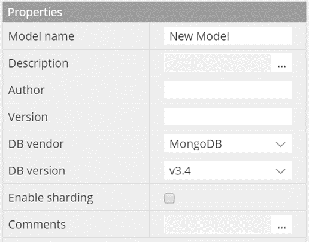
 

You can also define the entity hierarchy of the database:

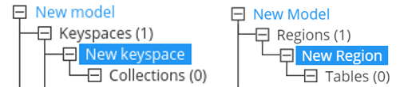

  3. Field types

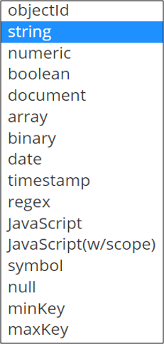

Each field type has its own set of properties and behaviours described in
configurations. Type changes affect UI of ERD (model view), DTD (collection
view) and behaviour of context menu:

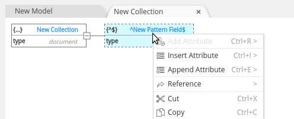

 

Plugin structure
----------------

Plugins are stored in \~/**.hackolade/plugins** directory. Plugin folder name
should be the same as **name** property in package.json file of your plugin.

**package.json** file is the plugin entry point. This file is required and
contains initial info about plugin such as name, version, author, target name
etc.. It should be placed in the root of your plugin folder. Package.json should
contain several required properties that guarantee its uniqueness:

-   *Name*

-   *Contributes*

-   *Author*

*See more details about each field of* [package.json](#package.json) *file.*

**logo.jpg** - plugin logo image that will be displayed in the list of plugins.
Name and extension of the file shouldn’t and cannot be changed. The file is
placed in the root folder next to the package.json file. If not set - the first
letter from **name** property in package.json file will be used instead of logo.

 

[1] Properties pane structure
-----------------------------

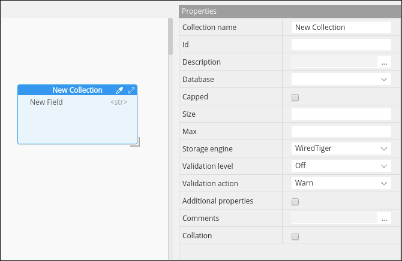

Properties pane visual structure depends on the selected item (entity). There
are several entity types in Hackolade that change the structure:

1.  model

2.  container

3.  collection

4.  view

5.  field

Each entity can have several tabs. Current version supports customizing
**details** tab only.

All configurations are stored in **properties_pane** folder and situated in the
root of plugin folder. Each entity has own folder with corresponding naming:

-   **model_level**

-   **container_level**

-   **collection_level**

-   **view_level**

-   **field_level**

Inside each folder there’s a **[ENTITYNAME]LevelConfig.json** file which
contains configurations for PP.

You can add **defaultData.json** file to a **properties_pane** folder to define
default values that will be displayed in the PP. Here’s an example of properties
pane folder structure:

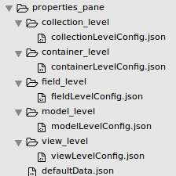

Each **\*.json** file represents an array with objects. Each object has
configurations for a particular tab. Tab name is defined in modeName property.
All properties are defined as array and have the same structure across all PP
configurations. Here’s an example of details tab with one property **comments:**

 

~~~~~~~~~~~~~~~~~~~~~~~~~~~~~~~~~~~~~~~~~~~~~~~~~~~~~~~~~~~~~~~~~~~~~~~~~~~~~~~~
[
    {
        "modeName": "Details",
        "structure": [
            {
                "fieldName": "Comments",
                "fieldKeyword": "comments",
                "shouldValidate": false,
                "fieldTooltip": "comments",
                "fieldType": "details",
                "template": "textarea",
                "valueType": "string"
            }
        ]
    }
]
~~~~~~~~~~~~~~~~~~~~~~~~~~~~~~~~~~~~~~~~~~~~~~~~~~~~~~~~~~~~~~~~~~~~~~~~~~~~~~~~

 

*For detailed information about each property see* [Property Pane Structure
API](#property-pane-structure-api)*.*

 

[2] Localization
----------------

Localization folder contains files for language / target localization of your
application. Language localization can be implemented by creating **\*.json**
files inside **localization** folder. File name for localization should
correspond to ISO naming convention (e.g. **en** for English localization)

Each localized item inside **\*.json** file is represented by a key/value pair
e.g.:

 

~~~~~~~~~~~~~~~~~~~~~~~~~~~~~~~~~~~~~~~~~~~~~~~~~~~~~~~~~~~~~~~~~~~~~~~~~~~~~~~~
"MAIN_MENU___ADD_COLLECTION": "Add Collection"
~~~~~~~~~~~~~~~~~~~~~~~~~~~~~~~~~~~~~~~~~~~~~~~~~~~~~~~~~~~~~~~~~~~~~~~~~~~~~~~~

 

If you delete any predefined property from this file - default text will be
displayed.

 

[3] Field types
---------------

There are 7 basic types in Hackolade:

1.  String

2.  Boolean

3.  Numeric

4.  Document

5.  Array

6.  Binary

7.  Null

If you don’t need to change name and behaviour of basic types - you can skip
this configuration block. If you want to customize basic type or create a custom
type - you can create your own configuration. The only condition is that new
type must be INHERITED from the basic type.

For example in order to create custom type \<list\> on the base of the \<array\>
type it is necessary to perform several steps:

1.  Create list.json file inside **types** folder situated in the root of plugin
    folder (notice that file name should be the same as type name)

2.  Set name, parent type (one out of list of 7 base types) and abbreviations
    for your custom type in the properties object inside list.json file:

 

~~~~~~~~~~~~~~~~~~~~~~~~~~~~~~~~~~~~~~~~~~~~~~~~~~~~~~~~~~~~~~~~~~~~~~~~~~~~~~~~
{
    "name": "list",
    "erdAbbreviation": "<list>",
    "dtdAbbreviation": "[...]",
    "parentType": "array"
}
~~~~~~~~~~~~~~~~~~~~~~~~~~~~~~~~~~~~~~~~~~~~~~~~~~~~~~~~~~~~~~~~~~~~~~~~~~~~~~~~

 

*To learn more about all properties take a look at* [types API](#field-types-1)

 

API Reference
=============

Package.json
------------

**name** *(string)* - required; unique plugin name

**version** *(string)* - required; used to compare versions and provide
possibility to update plugin

**versionDate** *(string)* - optional; value will be displayed in the plugins
list;

**author** *(string)* - required; defines plugin author

**engines** *(object)* - required; used to define which Hackolade version
supports plugin;

Example:

~~~~~~~~~~~~~~~~~~~~~~~~~~~~~~~~~~~~~~~~~~~~~~~~~~~~~~~~~~~~~~~~~~~~~~~~~~~~~~~~
"engines": {
    "hackolade": "1.6.x",
    }
~~~~~~~~~~~~~~~~~~~~~~~~~~~~~~~~~~~~~~~~~~~~~~~~~~~~~~~~~~~~~~~~~~~~~~~~~~~~~~~~

 

**contributes** *(object)* - required; provides information about target and
available features.

Example:

~~~~~~~~~~~~~~~~~~~~~~~~~~~~~~~~~~~~~~~~~~~~~~~~~~~~~~~~~~~~~~~~~~~~~~~~~~~~~~~~
"contributes": {
    "target": {
        "applicationTarget": "MONSTOR",
        "title": "MonStor",
        "versions": [
            "v1.0"
        ]
    },
    "features": {
        "nestedCollections": true
    }
}
~~~~~~~~~~~~~~~~~~~~~~~~~~~~~~~~~~~~~~~~~~~~~~~~~~~~~~~~~~~~~~~~~~~~~~~~~~~~~~~~

 

**target** *(object) -* provides information about target name for which the
plugin was created; applicationTarget value should be uppercase.

**features** *(object)* - optional; object which defines what features will be
enabled or disabled; Key is the name of feature. Value - true or false;

Available features:

-   nestedCollections

**description** - optional; this data will be displayed in the list of plugins;

**disabled** - optional; used to disable plugin; by default - false or nothing

 

Property Pane Structure API
---------------------------

Property pane structure is represented by array of objects with two properties:

-   modeName

-   structure

**modeName** is used to define type of tab for the entity. There are several
modes of tabs in the application:

-   Details

-   Collection level users

-   Indexes

-   Sharding

-   Relationships

-   Model level users

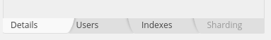

**structure** property represents a collection of objects, each describing field
type and behaviour.

 

~~~~~~~~~~~~~~~~~~~~~~~~~~~~~~~~~~~~~~~~~~~~~~~~~~~~~~~~~~~~~~~~~~~~~~~~~~~~~~~~
[
    {
        "modeName": "Details",
        "structure": [
            {
                "fieldName": "Comments",
                "fieldKeyword": "comments",
                "shouldValidate": false,
                "fieldTooltip": "comments",
                "fieldType": "details",
                "template": "textarea",
                "valueType": "string"
            }
        ]
    }
]
~~~~~~~~~~~~~~~~~~~~~~~~~~~~~~~~~~~~~~~~~~~~~~~~~~~~~~~~~~~~~~~~~~~~~~~~~~~~~~~~

 

**fieldName** *(string)* - required; used to display label in PP for a field;

**fieldKeyword** *(string)* - required; used in the main code as a keyword; no
whitespaces are allowed; should be lowercase;

**shouldValidate** *(string)* - optional; defines whether field should be
validated or any value is allowed;

**fieldType** *(string)* - required; field types; can be simple or complex;
simple types are select inputs or text inputs. Complex types usually use modal
windows; Available field types to use when customizing PP properties are:

-   select (used with **options** property)

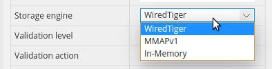

-   details (used to add description or comments with defined template property

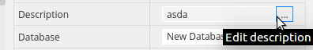

-   text

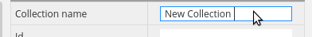

**template** *(string)* - optional; template that is used in the modal window if
fieldtype is complex

-   Textarea

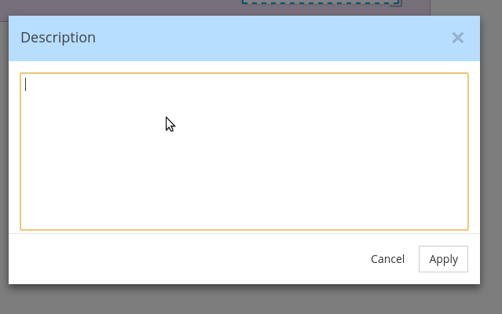

**valueType** *(string)* - optional; type (one out of 7 basic types) to define
validation rules

**options** *(array)* - optional; used to define options in the select input if
fieldType is selected

 

Field types
-----------

**name** *(string)* - required; type name

**erdAbbreviation** *(string)* - optional; abbreviation that is used to display
in the ERD table

**dtdAbbreviation** *(string)* - optional; abbreviation used to define field
visually on DTD

**parentType** *(string)* - optional; one out of 7 base types (used if custom
type should be created)

**sample** *(string)* - optional; value that is used to display it in the
corresponding input in PP by default

**useSample** *(boolean)* - optional; defines whether to use default value for
sample or not

**mode** *(array)* - required for numeric fields; there are 4 base modes for
numeric types:

-   Integer32

-   Integer64

-   Decimal128

-   Double

It is possible to define own mode with custom name that inherits base mode
behaviour (esp. validation). For example here’s how a new mode **int** will be
created:

~~~~~~~~~~~~~~~~~~~~~~~~~~~~~~~~~~~~~~~~~~~~~~~~~~~~~~~~~~~~~~~~~~~~~~~~~~~~~~~~
{
    "name": "int"
    "parentType": "integer32",
    "sample": 12
}
~~~~~~~~~~~~~~~~~~~~~~~~~~~~~~~~~~~~~~~~~~~~~~~~~~~~~~~~~~~~~~~~~~~~~~~~~~~~~~~~

 

**defaultValues** *(array)* - optional; used to define properties in PP; can be
different and custom for each type

 

Usage
-----

TODO: Write usage instructions

Contributing
------------

1.  Fork it!

2.  Create your feature branch: `git checkout -b my-new-feature`

3.  Commit your changes: `git commit -am 'Add some feature'`

4.  Push to the branch: `git push origin my-new-feature`

5.  Submit a pull request :D

History
-------

TODO: Write history

Credits
-------

TODO: Write credits

License
-------

TODO: Write license
