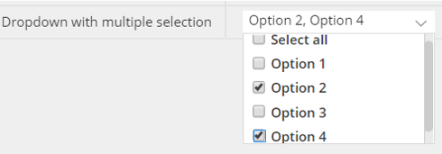
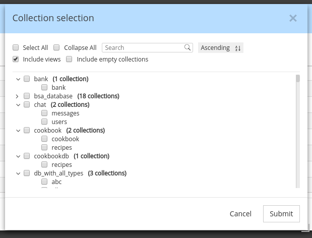

# Hackolade NoSQL DB data modeling plugins

This page is the documentation for the repository of Hackolade plugins.  Plugins let anyone create support so new NoSQL databases can leverage the Hackolade data modeling engine, if they're not already natively supported in Hackolade.  Several plugins have been created by Hackolade for leading NoSQL databases, but you may build your own and have it listed in the DB Target Plugin Manager of the application.

The plugin architecture of Hackolade lets you create your own NoSQL database ‘targets’, respecting its characteristics, through a combination of configuration and custom JavaScript code.  Custom JS code is only necessary for Reverse- and Forward-Engineering.

**Note** that targets are not limited to NoSQL databases!  The Hackolade data modeling engine is applicable also to file formats, serialization IDLs, API definitions, relational databases, etc.

The process includes 3 main steps:

1. [preparation](#preparation)
2. [plugin creation](#creation)
3. [publication](#publication)
4. See also our [license](#license)

This guide walks you through the steps to create your own plugin in your own GitHub repository. Once you’re ready to make your plugin public, you may create a pull request for your entry in the registry file in this repository.  

## 1. Overview and preparation

Each NoSQL database has its own personality: terminology, storage
approach, primary keys, data types, indexing, partitioning/sharding, API, query language, etc...
At Hackolade, after adapting our engine to a couple of rather different NoSQL
vendors, we quickly realized that we were going to have a hard time keeping up
with the frequent appearance of new databases on the market. So, in order to
unleash the power of our data modeling engine, we decided to rewrite the
application and open up our features through a plugin architecture.

With the customization of the properties pane, you're able to control attributes
specific to each DB at the following levels: model, container, entity,
field/attribute, indexing, sharding, etc...

The customization is performed through the configuration of the following modules:

1. [localization](#prepLocalization)
2. [data types](#prepTypes)
3. [properties panes](#prepPanes)
4. [connection and authentication](#prepConnection) parameters
5. [reverse-engineering](#prepRE) parameters for document sampling and schema inference
6. [forward-engineering](#prepFE) if the target DB supports it 

 

### 1.1 Hierarchy and localization

You first need to carefully define the hierarchy for the database, and its related terminology. Consider some differences between the MongoDB and the Couchbase hierarchies, for example:

 

### 1.2 Data types

Next, you need to define data types.  Many databases simply support the standard JSON data types.  Others have additional data types with special behaviors.  

You may specify the order in which the data types appear.
 

### 1.3 Properties pane

Each data type can inherit default properties and constraints from the standard
Hackolade configurations.  But you may want to create additional properties and constraints for some data types.  To define these properties and controls, you may choose among different controls:

The same controls can be used to define information in different properties panes and lower tabs, for example for indexing, sharding, etc..
 

### 1.4 Connection and authentication parameters

In order for reverse-engineering to be performed, it is first necessary to connect to the database.  You need to define the protocol, connection parameters, and authentication parameters.

 

### 1.5 Reverse-engineering

For Reverse-Engineer to be performed, it is required to write custom JavaScript code.  
This code will connect to the database according to the connection parameters defined above.  It will also invoke queries to discover the database objects so the user can select what needs to be reverse-engineered. Finally, the code will query the database to obtain a sample and pass it on to Hackolade's engine for schema inference.
 

### 1.6 Forward-engineering

For Forward-Engineer to be performed, it is required to write custom JavaScript code.  
This code will generate target-specific scripts, according to the syntax of the target.
 

## 2. Plugin creation

The easiest way to create a new plugin is to copy an existing one as a starting
point, and to edit it progressively, verifying along the way that the desired
behavior gets reflected in the application. When choosing an existing plugin,
make sure to take one with a storage model as close as possible to yours.

It is **strongly** suggested to operate carefully, progressing with small steps, and testing very frequently.  The application requires to be restarted to load the plugin configuration modifications.  If the plugin does not appear in the target selection dialog when creating a new a model, that's generally a sign that there are JSON syntax errors or conflicts.

Plugins are stored in the **%userprofile%/.hackolade/plugins** directory. The plugin folder name must be the same as the **name** property in package.json file of your
plugin.

The creation process follows these steps:

1. [package.json file](#creaPackage)
2. [logo file](#creaLogo)
3. [localization file](#creaLocalization)
4. [data types](#creaTypes)
5. [properties panes](#creaPanes)
6. [input controls](#creaControls)
7. [reverse-engineering](#creaRE) 
8. [forward-engineering](#creaFE) 

### 2.1 package.json

The **package.json** file is the plugin entry point. This file is required and
contains initial info about plugin such as name, version, author, target name
etc.. It must remain in the root of your plugin folder. 

The mapping below shows how the information is used throughout the application.

**name** *(string)* - required; unique plugin name

**version** *(string)* - required; used to compare versions and provide
possibility to update plugin

**versionDate** *(string)* - optional; for internal use only

**author** *(string)* - required; defines plugin author

**engines** *(object)* - required; used to define the lowest Hackolade version
supporting this plugin

Example:

    "engines": {
        "hackolade": "1.9.x",
        }

**contributes** *(object)* - required; provides information about the database
target and available features

Example:

    "contributes": {
        "target": {
            "applicationTarget": "ELASTICSEARCH",
            "title": "Elasticsearch",
            "versions": [
                "v6.0"
            ]
        },
        "features": {
            "nestedCollections": true
        }
    }

 

**target** *(object) -* provides information about target name for which the
plugin was created; applicationTarget value must be uppercase

**features** *(object)* - optional; object which defines what features will be
enabled or disabled; Key is the name of feature. Value - true or false;

Available features:

- nestedCollections *(boolean)* - optional: if true, enables parent-child entities [default: false]
- disablePatternField *(boolean)* - optional: if false, disables the ability to define attributes as pattern fields [default: false]

**description** - optional; this data will be displayed in the list of plugins

**disabled** - optional; used to mark the plugin as disabled [default: false]

### 2.2 Logo file

**logo.jpg** - the plugin logo image to be displayed in the list of plugins. Name and extension of the file cannot be changed. The file is placed in the root folder next to the package.json file. If not set - the first letter from **name** property in package.json file will be used instead of a logo.

### 2.3 Localization

The localization folder contains files for language / target localization of the target database. Language localization can be implemented by creating **\*.json**
files inside **localization** folder. File name for localization should
correspond to ISO naming convention (e.g. **en** for English localization)

Each localized item inside **\*.json** file is represented by a key/value pair
e.g.:

    "MAIN_MENU___ADD_COLLECTION": "Add Collection"

 

If you delete any predefined property from this file - default text will be
displayed.

 

### 2.4 Base data types

There are 7 base types in Hackolade:

1. String
2. Boolean
3. Numeric
4. Document
5. Array
6. Binary
7. Null

If you don’t need to change name and behavior of basic types - you can skip this configuration block. If you want to customize basic type or create a custom type - you can create your own configuration. The only condition is that new type must be INHERITED from the basic types above.

For example in order to create custom type \<list\> using the \<array\> type as a basis, it is necessary to perform the following steps:

a.  Create list.json file inside **types** sub-folder of the plugin folder (notice that file name should be the same as type name)

b.  Edit list.json to set the name, parent type (one out of list of 7 base types) and abbreviations for your custom type in the properties object inside list.json file:

    {
        "name": "list",
        "erdAbbreviation": "<list>",
        "dtdAbbreviation": "[...]",
        "parentType": "array"
    }

Some data datatypes have many subtypes.  For example a numeric datatype may allow: integer, smallint, bigint, float, double, etc...  In such case, we advise to only define one datatype (numeric) and put the subtypes in a dropdown mode. 

The syntax works as follows:
**name** *(string)* - required; type name

**erdAbbreviation** *(string)* - optional; abbreviation that is used to display
in the ERD table

**dtdAbbreviation** *(string)* - optional; abbreviation used to define field
visually on DTD

**parentType** *(string)* - optional; one out of 7 base types (used if custom
type should be created)

**sample** *(string)* - optional; value that is used to display in the
corresponding input in Property Pane by default

**useSample** *(boolean)* - optional; defines whether to use default value for
sample or not

**mode** *(array)* - required for numeric fields; there are 4 base modes for
numeric types:

- integer32
- integer64
- decimal128
- double

It is possible to define own mode with custom name that inherits base mode
behaviour (esp. validation). For example here’s how a new mode **int** will be
created:

    {
        "name": "int"
        "parentType": "integer32",
        "sample": 12
    }

**defaultValues** *(array)* - optional; used to define properties in PP; can be
different and custom for each type

 

### 2.5 Properties pane structure

There are multiple levels in the Hackolade hierarchy:

1. model: each Hackolade file represents one model for a given DB target
2. container: a database, a namespace, a bucket, a keyspace, or a region
3. entity: a collection, a table, an index
4. field: an attribute
5. view (if applicable)

The properties pane can be configured for each level.  And each level can have multiple properties pane tabs.

#### 2.5.1 Hierarchy

All configurations are stored in the **properties_pane** sub-folder of the plugin folder. Each level has its own sub-folder with corresponding naming:

- **model_level**
- **container_level**
- **entity_level**
- **field_level**
- **view_level**

Inside each folder there’s a **[LEVELNAME]LevelConfig.json** file which contains configurations for its properties pane tabs.

You can add **defaultData.json** file to a **properties_pane** folder to define
default values to be displayed in the properties pane. 

#### 2.5.2 Lower tab properties pane

Each **\*.json** file represents an array with objects. Each object has
configurations for a particular tab. Tab name is defined in **lowerTab** property.
All properties are defined as an array and have the same structure across all properties pane configurations. Here’s an example of details tab with one property **comments:**

    [
        {
            "lowerTab": "Details",
            "structure": [
                {
                    "propertyName": "Comments",
                    "propertyKeyword": "comments",
                    "propertyTooltip": "comments",
                    "propertyType": "details",
                    "template": "textarea",
                    "valueType": "string"
                }
            ]
        }
    ]

**lowerTab** is used to define the lower tab for the hierarchical level, such as details, indexes, sharding, etc...

**structure** property represents a collection of objects, each describing field
type and behavior.

#### 2.5.3. Container Level Keys

Container Level Keys - fields which are the keys at the container level and automatically added to entities when they are created. They are defining at **containerLevelConfig** by property **containerLevelKeys**. For example:

    {
        "containerLevelKeys": [...],
        "structure": [...],
        "lowerTab": "..."
    }

Setting container level keys has the similar structure to [Property controls](#creaControls). For example key with name "Index":

    {
        "containerLevelKeys": [{
            "labelName": "Index",
            "defaultName": "_index",
            "propertyPrimaryKey": true,
            "typeName": "Data type",
            "typeOptions": ["string"],
            "defaultType": "string",
            "disabledFieldOption": true,
            "sampleGen": "&containerName",
            "propertyName": "Index",
            "propertyKeyword": "index",
            "propertyType": "text"
        }]
    }

**labelName** *(string)* - required; name of property in properties pane

**propertyPrimaryKey** *(boolean)* - required; whether the field is a primary key

**typeName** *(string)* - required; label name of selector type

**typeOptions** *(array)* - required; variant of types for field

**defaultType** *(string)* - optional; default field type

**defaultName** *(string)* - optional; default name of field

**sampleGen** *(string)* - optional; generate sample for field in preview, can contains next variants:

1. *&random* - will generate random value
2. *&entityName* - link to entity name
3. *&containerName* - link to container name
4. *constant* - some constant value

**disabledFieldOption** *(boolean)* - optional; disable options of field

 

### 2.6 Property controls

Different input controls can be defined for each property:

1. simple text
2. text area (pop-up text)
3. dropdown selection (unique)
4. dropdown selection (multiple)
5. numeric
6. checkbox (boolean)
7. properties group
8. properties block
9. field list
10. field list with dropdown of attributes
11. select from a list of entities

Each control is further described below.  The control is defined using the following syntax:  
**propertyName** *(string)* - required; used to display label in the Properties
Panes for a property.

**propertyKeyword** *(string)* - required; used in the main code as a keyword; no
whitespaces are allowed.

**propertyType** *(string)* - required; field types; possible values are:

1. simple text: [text](#text)
2. text area (pop-up text): [details](#details)
3. dropdown selection (unique): [select](#select)
4. dropdown selection (multiple): [multiselect](#multiselect)
5. numeric: [numeric](#numeric)
6. checkbox (boolean): [checkbox](#checkbox)
7. properties group: [group](#group)
8. properties block: [block](#block)
9. field list: [tagInput](#tagInput)
10. field list with dropdown of attributes: [tagInputAttrib](#tagInpputAttrib)
11. select from a list of entities: selectHashed

**template** *(string)* - optional; template used in the modal window if propertyType is details; possible value is: 

- details: textarea, or textareaJSON (input is validated to be JSON)
- tagInput: collectiontree

**markdown**: *(boolean)* - optional (default = true): if "propertyType": "details" and "template": "textarea", markdown can be turned off (for example for functions)

**addTimeStampButton** (*boolean*) - optional (default = false): if "propertyType": "details" and "template": "textarea", a button "Add timestamp" can be made to appear

**options** *(array)* - optional: used to define options in the select input if propertyType is select.

**propertyTooltip** *(string)* - optional: only taken into account for propertyTypes: text area,  dropdown, properties group, and field list

**inputPlaceHolder** *(string)* - optional: hint appearing greyed out in text background****

**defaultValue** *(string/number/boolean)* - optional; default value for property

**valueType** *(string)* - optional; type (one out of 7 basic types) to define validation rules.

**shouldValidate** *(boolean)* - optional (default = false): defines whether field should be validated or any value is allowed.  Validation rules are defined once in validationRegularExpressions.json, and are the same in any matching propertyName in any level.  

**regex** *(string)* - optional: defines the regex validation for this specific property (the same propertyName could have a different validation rule elsewhere.)

**allowNegative** (*boolean*) - optional (detault = true): for numeric controls only.  Self explanatory

**minValue** (*number*) - optional: for numeric controls only. Self explanatory

**maxValue** (*number*) - optional: for numeric controls only. Self explanatory

**dependency** *(object)* - optional: contains an object with a key and arguments determining whether or not to display this property.  
Example of a simple dependency, testing the value of a previous property:

        "dependency": {
            "key": "type",
            "value": "string"
        }

Example of a dependency, testing for the presence of a previous property:

        "dependency": {
            "key": "name",
            "exists": false
        }

Example of a dependency, testing for the properties of the string characteristics of another property:

        "dependency": {
            "key": "name",
            "minLength": 5,
            "maxLength": 10
        }

Example of a dependency, testing for the properties of the regex pattern value of another property:

        "dependency": {
            "key": "name",
            "pattern": "^(H|h)ackolade (2.5.8|3.0.2)$"
        }

Example of a dependency, testing for the properties of the numeric value of another property:

        "dependency": {
            "key": "amount",
            "minimum": 10,
            "exclusiveMinimum": true,
            "maximum": 100
        }

Example of a dependency combining *and* and *or* operators:

        "dependency": {
            "type": "and",
            "values": [
                {
                    "type": "or",
                    "values": [
                        {
                            "level": "parent",
                            "key": "name",
                            "value": "query"
                        },
                        { 
                            "level": "parent",
                            "key": "name",
                            "value": "formData"
                        }
                    ]
                },
                {
                    "level": "parent",
                    "key": "structureType",
                    "value": true
                }
            ]
        }

**enableForReference** (*boolean*) - optional: by default, properties of references to a definition (local, model or external) are typically disabled.  By setting this to *true*, the property is enabled for editing, e.g. required.

**disabledOption** (*boolean*) - optional (default = false): only applicable to "propertyKeyword": "dropdownProp" if the dropdown list must appear in grey and disabled.

**disableOnCondition** (*object*) - optional: disables the property if any of conditions is true for the current entity. Must be an array of condition objects. The condition object can have the following structure:

    {
        "key" - property name of the current entity,
         "exist": true, - if the property with "key" exists on current entity this property is disabled,
         or "value" - if "key" is equal to "value" this property is disabled 
    }

For your properties, you may choose among a number of input controls:

#### 2.6.1. simple text

    {
        "propertyName": "Simple text",
        "propertyKeyword": "simpletextProp",
        "propertyType": "text",
        "valueType": "string"
    }

#### 2.6.2. text area (pop-up box)

Used to add a description or comments with defined template property

    {
        "propertyName": "Text area",
        "propertyKeyword": "textareaProp",
        "propertyTooltip": "Popup for multi-line text entry",
        "propertyType": "details",
        "template": "textarea",
        "markdown": false
    }

#### 2.6.3. dropdown selection (unique)

    {
        "propertyName": "Dropdown selection",
        "propertyKeyword": "dropdownProp",
        "shouldValidate": false,
        "propertyTooltip": "Select from list of options",
        "propertyType": "select",
        "options": [
            "Option 1",
            "Option 2",
            "Option 3",
            "Option 4"
        ]
    }

#### 2.6.4. dropdown selection (multiple)

    {
        "propertyName": "Dropdown with multiple selection",
        "propertyKeyword": "dropdownMulti",
        "propertyTooltip": "Select from list of options",
        "propertyType": "multipleCheckboxSelect",
        "options": [
            "Option 1",
            "Option 2",
            "Option 3",
            "Option 4"
        ]
    }

#### 2.6.5. numeric

    {
        "propertyName": "Numeric",
        "propertyKeyword": "numericProp",
        "propertyType": "numeric",
        "valueType": "number",
        "allowNegative": false,
        "minValue": 0,
        "maxValue": 1,
        "step": 0.01,
        "propertyValidate": true
    },

#### 2.6.6. checkbox (boolean)

    {
        "propertyName": "Checkbox",
        "propertyKeyword": "checkboxProp",
        "propertyType": "checkbox"
    },

#### 2.6.7. properties group

    {
        "propertyName": "Group",
        "propertyType": "group",
        "propertyKeyword": "grpProp",
        "propertyTooltip": "",
        "structure": [
            {
                "propertyName": "Simple Grp Text",
                "propertyKeyword": "simpleGrpText",
                "propertyType": "text"
            },
            {
                "propertyName": "Group Number",
                "propertyKeyword": "grpNumber",
                "propertyValidate": true,
                "propertyType": "numeric",
                "valueType": "number",
                "allowNegative": false
            }
        ]
    }

#### 2.6.8. properties block

A *block* control is similar to a *group* control except for the fact that there can only be 0 or 1 block entry, whereas groups allows between 0 and multiple entries.

#### 2.6.9. field list

    {
        "propertyName": "Field List",
        "propertyKeyword": "keyList",
        "propertyType": "tagInput",
        "template": "collectiontree"
    }

#### 2.6.10. field list with dropdown of attributes

    {
        "propertyName": "Field List w/ dropdown",
        "propertyKeyword": "keyListOrder",
        "propertyType": "tagInput",
        "template": "collectiontree",
        "types": [
            "ascending",
            "descending"
        ]
    } 

  

#### **2.6.11.**  **select from a list of entities**

SelectHashed

### 2.7 Reverse-Engineering

All configurations for Reverse-Engineering are stored in folder **reverse_engineering**. 

The reverse-engineering structure is represented by several blocks and include:

- [configuration](#connectConfig) for connection settings modal and authentication
- [API program](#APIprogram) to access the DB and perform reverse-engineering
- [error messages](#errMessages)
- package file with npm modules [dependencies](#dependencies)

#### 2.7.1 Connection parameters and authentication

Connection and authentication params and connection settings modal configuration are defining in the **connectionSettingsModalConfig.json** file.

    [
        {
            "lowerTab": "Connection",
            "structure": [
                {
                    "inputLabel": "Disable SSl Authentication",
                    "inputKeyword": "disableSSL",
                    "inputType": "checkbox",
                    "inputTooltip": "Disable SSl Authentication for local instance"
                }
            ]
        }
    ]

This config contain a list of templates (tabs) for different part of connection settings split by categories and has the next structure:

**lowerTab** *(string)* - required; tab name in connection settings modal

**structure** *(array)* - required; list of inputs for connection settings modal

**inputLabel** *(string)* - required; connection settings input label

**inputKeyword** *(string)* - required; keyword for connection settings param which is used in the RE process

**inputType** *(string)* - required; type of connection settings input. Available input types to use when customizing connection settings template are:

- text
- checkbox
- password

**inputTooltip** *(string)* - optional; connection settings input tooltip message

**inputPlaceholder** *(string)* - optional; placeholder for connection settings input

**isHiddenKey** *(string)* - optional; flag that defines values which would be replaced by ****** in the log file

**defaultValue** *(string)* - optional; default value for connection settings param

#### 2.7.2 Programming of Reverse-Engineering

The file **api.js** contains hooks which are called by the Hackolade application. Hackolade passes its context data into the hooks and accepts results of reverse-engineering in callbacks. 

Depending on the selected RE scenario (see Scenario in [configuration](# errMessages), below) different hooks are called. The list of the hooks:

*Common*:

- testConnection()
- getDbCollectionsData()
- disconnect()

*Scenario-specific*:

- getDatabases()
- getDocumentKinds()
- getDbCollectionsNames()

**API hooks**

**testConnection**(*connectionInfo, logger, callback*)

Test current connection

| Name           | Type              | Description                                                                                                                                                  |
| -------------- | ----------------- | ------------------------------------------------------------------------------------------------------------------------------------------------------------ |
| connectionInfo | object            | Hackolade connection info see **ConnectionInfo**                                                                                                          |
| logger         | object            | Hackolade connection logger see **Logger**                                                                                                                |
| callback       | callback function | **callback**(*undefined \| error*) - **undefined**: *connection succeeds (empty callback) - **error**: *connection fails with an error (error object)* |

**getDatabases**(*connectionInfo, logger, callback*)

Get the list of databases

| Name           | Type              | Description                                                                                                                                 |
| -------------- | ----------------- | ------------------------------------------------------------------------------------------------------------------------------------------- |
| connectionInfo | object            | Hackolade connection info see **ConnectionInfo**                                                                                         |
| logger         | object            | Hackolade connection logger see **Logger**                                                                                               |
| callback       | callback function | **callback**(*error, databases*)  - **error** *(Error object)* - **databases** *(array[string]]): a list of the accessible databases* |

**getDocumentKinds**(*connectionInfo, logger, callback*)

Get document kinds of current database

| Name           | Type              | Description                                                                                                                                                              |
| -------------- | ----------------- | ------------------------------------------------------------------------------------------------------------------------------------------------------------------------ |
| connectionInfo | object            | Hackolade connection info see **ConnectionInfo**                                                                                                                      |
| logger         | object            | Hackolade connection logger see **Logger**                                                                                                                            |
| callback       | callback function | **callback**(*error, documentKinds*)  - **error** (Error object) - **documentKinds** (array[string]]): *a list of the accessible documentKinds in chosen database* |

**getDbCollectionsNames**(*connectionInfo, logger, callback*)

Get the list of databases and the list of entities within these databases

| Name           | Type              | Description                                                                                                               |
| -------------- | ----------------- | ------------------------------------------------------------------------------------------------------------------------- |
| connectionInfo | object            | Hackolade connection info see **ConnectionInfo**                                                                       |
| logger         | object            | Hackolade connection logger see **Logger**                                                                             |
| callback       | callback function | **callback**(*error, collectionNames*)  - **error** *(Error object)* - **collectionNames** see **collectionNames**. |

**getDbCollectionsData**(*connectionInfo, logger, callback*)

Get the data from the connection based on chosen databases, document kinds or entities

| Name           | Type              | Description                                                                                                              |
| -------------- | ----------------- | ------------------------------------------------------------------------------------------------------------------------ |
| connectionInfo | object            | Hackolade connection info see **ConnectionInfo**                                                                      |
| logger         | object            | Hackolade connection logger see **Logger**                                                                            |
| callback       | callback function | **callback**(*error, collectionsData*)  - **error** *(Error object)* - **collectionsData** see **collectionsData** |

**disconnect**(*connectionInfo, logger, callback*)

Disconnects the current session from Hackolade

| Name           | Type              | Description                                         |
| -------------- | ----------------- | --------------------------------------------------- |
| connectionInfo | object            | Hackolade connection info see **ConnectionInfo** |
| logger         | object            | Hackolade connection logger see **Logger**       |
| callback       | callback function |                                                     |

**API references:**

**ConnectionInfo**

Connection parameters and authentication

*type: object*

System parameters:

* **id** (string): *id of current connection*
* **pluginPath** (string): *path to the plugin*
* **appVersion** (string): *application version*
* **fieldInference** (object): setting of field inference to define whether keep the field order or no:
  - **active** (string): “field” | “alphabetical” 
* **recordSamplingSettings** (object):* sampling settings to define the number for perform documents sampling:*
  - **absolute** (object):
    - value (number): the absolute number of documents
  - **relative** (object):
    - value (number): the relative number of documents (in percentage)
  - **active** (string): what type of sampling is active (“absolute” | “relative”)
  - **maxValue** (number): the maximum value for sampling

Custom parameters (see property “inputKeyword” in “2.7.1 Connection parameters and authentication”) 

* **host** (string)
* **port** (string)

…..

**Logger**

Methods:
**log**(*status, content, title, hiddenKeys*)

| Name       | Type                | Description                                                          |
| ---------- | ------------------- | -------------------------------------------------------------------- |
| status     | string              | Status of the log message *Enums: [‘success’, ‘info’, ‘error’]*   |
| content    | string \| object | Error object or string with the log message                          |
| title      | string              | Title of the error or log message                                    |
| hiddenKeys | array[string]       | a list of the keys that should be hidden in the log (e.g.: password) |

**clear**() - method to clear the log file

**collectionNames**

List of the databases and their entities (see entity selection bellow)

type:  array[object]

Parameters:

* **dbCollections** (array[string]): *the list of entities names in the database*
* **dbName** (string): *the name of the database*

*Example:*

        {
            dbCollections: [“messages”, “users”],
            dbName: “chat”
        }

*Entity selection*

**collectionsData**

List of the entities data

*type: array[object]*

Parameters:

* **dbName** (string): *name of the database*
* **collectionName** (string): *name of entity*
* **documents** (array): *list of the documents from entity*
* **indexes** (array): *list of the entity indexes*
* **bucketIndexes** (array): **list of the container-level indexes*
* **views** (array): **list of views (if the database supports views)**
* **validation** (object): *object with JSON Schema based on document from entity in order to define some specific type (e.g. if we have value: 56 we can define this type as number or integer)*
* **validation**: 
  - **jsonSchema** (JSON Schema object) JSON schema from database model to be used instead of documents (in case we can get the schema from DB instance)
* **emptyBucket** (boolean): upload empty container or not  
* **bucketInfo** (object): object with container info
* **entityLevel** (object): entity level data with:
  - constraint (array): the list of constraints
* **documentTemplate** (object): *JSON object with template of document to have the right order of document attributes*

Example:

    [
        {
            "dbName": "graph.db",
            "collectionName": "Movies",
            "documents": [
                    {
                        "title": "The Matrix",
                        "tagline": "Welcome to the Real World",
                        "released": 1999
                    },
                    {
                        "title": "The Matrix Reloaded",
                        "tagline": "Free your mind",
                        "released": 2003
                    }
            ],
            "indexes": [],
            "bucketIndexes": [],
            "views": [],
            "validation": {
                    "jsonSchema": {
                        "required": [],
                        "properties": {
                            "released": {
                                    "type": "number",
                                    "mode": "integer",
                                    "sample": 1999
                            }
                        }
                    }
            },
            "emptyBucket": false,
            "bucketInfo": {},
            "entityLevel": {
                    "constraint": []
                },
            "documentTemplate": {
                    "title": "A League of Their Own",
                    "tagline": "Once in a lifetime you get a chance to do something different.",
                    "released": 1992
                }
            }
    ]

**selectionParams**

Selection params and connection info

*type: object*

Parameters:

* **collectionData** (object):
  - **collections** (object): **object with selected entities. Consists of keys with array of entities - <database name>: [<entity name>]*
  - **dataBaseNames** (array): *list of selected containers*
* **connectionSettings** (object): see **Connection parameters**
* **fieldInference** (object): setting of field inference to define whether keep the field order or no:
  - **active** (string): “field” | “alphabetical” 
* **recordSamplingSettings** (object): *sampling settings to define the number for perform documents sampling:*
  - **absolute** (object):
    - **value** (number): *absolute number of documents*
  - **relative** (object):
    - **value** (number): *percentage of total number of documents*
  - **active** (string): what type of sampling is active (“absolute” | “relative”)
  - **maxValue** (number): *maximum total number of documents for sampling*
* **includeEmptyCollection** (boolean): *reverse-engineer empty entities*
* **includeSystemCollection** (boolean): *reverse-engineer system entities* 
* **pagination** (object):  *for Couchbase: when pagination is present*
  - **enabled** (boolean)
  - **value** (number) *number of pages for connection*

Example:

    {
        "collectionData": {
            "collections": {
                   "chat": [
                       "messages",
                       "users"
                   ]
        },
        "dataBaseNames": [
                   "chat"
            ]
        },
        "fieldInference": {
            "active": "field"
        },
        "includeEmptyCollection": false,
        "pagination": {
            "enabled": false,
            "value": 1000
        },
        "pluginPath": "/home/user/.hackolade/plugins/Cassandra",
        "recordSamplingSettings": {
            "absolute": {
                   "value": 1000
            },
            "active": "absolute",
            "maxValue": 10000,
            "relative": {
                   "value": 10
            }
        },
        "target": "CASSANDRA",
        "hiddenKeys": [
            "options"
        ]
    }

#### 2.7.3 Configuration

The file **config.js** consists of error message list and properties 

**errors** *(object)* - list of error messages

**excludeDocKind** *(array)* - list of properties which would be excluded from select docType modal

**scenario** *(string)* - name of the scenario used for the reverse-engineering process.  Defines in which order the API hooks will be called. Possible values are: “connectToDB” (default), “getDatabases”, “getDocumentKinds”. 

1. “**connectToDB**” - in case the target database allows to maintain several databases and entities. Hackolade calls the “**getDbCollectionsNames**” hook to retrieve a list of databases and their entities. 
2. “**getDatabases**” - in case the target database allows to maintain several databases without splitting data into entities. Hackolade calls the “**getDatabases**” hook to retrieve a list of databases and then “**getDocumentKinds**” to retrieve a list of document kinds inferred from data.
3. “**getDocumentKinds**” - in case the target database does not allow to maintain neither databases, nor entities. Hackolade calls the “**getDocumentKinds**” hook to retrieve a list of document kinds inferred from data.

In every scenario Hackolade also calls the “getDbCollectionsData” to actually retrieve the reverse-engineering data.

    {
        "errors": {
            "NO_DATABASES": "No database can be found in CosmosDB instance",
            "WRONG_CONNECTION": "Cannot connect to CosmosDB instance"
        },
        "excludeDocKind": ["id"],
        “scenario”: "connectToDB"
    }

#### 2.7.4 Dependencies

The file **package.json** contains a list of dependencies that are required to execute RE via **api.js**
 
 

### 2.8 Forward-Engineering

All configurations for Forward-Engineering are stored in folder **forward_engineering**. 

The forward-engineering structure is represented by several blocks and include:

- [configuration](#FEconnectConfig) for connection settings modal and authentication
- [API program](#FEAPIprogram) to access the DB and perform reverse-engineering
- [error messages](#FEerrMessages)
- package file with npm modules [dependencies](#FEdependencies)
- filtering of unneeded propreties [Unneeded](#FEunneeded)

#### 2.8.1 Connection parameters and authentication

If forward-engineering can connect to the database instance (e.g. Cassandra), the connection and authentication params and connection settings modal configuration from reverse-engineering defined in the **connectionSettingsModalConfig.json** file are used.

#### 2.8.2 Programming of Forward-Engineering

The file **api.js** is an adapter between the Hackolade application and the target database that allows you to perform forward-engineering and process data using API methods.

#### 2.8.3 Configuration

The file **config.js** consists of error message list and properties

- **extension** (string): *file extension*

- **filterName** (string): *name of the file for download dialog*

- **namePrefix** (string): *name prefix for file*

- **validation** (boolean): *script/schema is validating by plugin*
  
  - **level** (object): *select levels of forward-engineering to generate*
  - **model** (boolean)
  - **container** (boolean)

- **entity** (boolean)

- **splitView** (object): *whether to display split forward-engineering tabs*
  
  - **openedByDefault** (boolean): split view on start

- **options** (array): *script/schema format variations*

- **additionalOptions**: *additional configuration options for script/schema generation* 
  
     {
  
         "extension": "json",
         "filterName": "application/json",
         "namePrefix": "OpenAPI Schema",
         "hasUpdateScript": false,
         "validation": true,
         "splitView": {
             "openedByDefault": true
         },
         "level": {
             "entity": false,
             "container": false,
             "model": true
         },
         "options": [
             { 
                 "name": "JSON", 
                 "keyword": "json", 
                 "fileExtensions": [
                     {
                         "label": "application/json", "value": "json"
                     } 
                 ]     
             },
             { 
                 "name": "YAML", 
                 "keyword": "yaml", 
                 "fileExtensions": [ 
                     {
                         "label": "application/yaml", "value": "yaml"
                     } 
                 ] 
             }
         ]
  
     }

#### 2.8.4 Dependencies

The file **package.json** contains a list of dependencies that are required to execute RE via **api.js**

#### 2.8.4 Unneeded properties

In the configuration file jsonSchemaProperties.json, it is possible to set:

- **uneededFieldProps** *(array)* - listed properties will be removed from forwarded JSON Schema on JSON Preview tab and JSON Schema forward-engineered files.
- **removeIfPropsNegative** *(array)* - listed properties will be removed from JSON Schema if the property value, converted to boolean, is equal to false (false, null, undefined) 

 

## 3. Plugin publication

In order for your plugin to appear as downloadable within the Hackolade Target Plugin Manager, you need to submit a Pull Request for a modification commit on https://github.com/hackolade/plugins/blob/master/pluginRegistry.json

Add a record with the following structure:

    {
        "name": "your-plugin-name",
        "target": "application-target",
        "author": "you",
        "authorRepo": "https://github.com/<you>",
        "description": "Target plugin description",
        "repository": "https://github.com/<you>/<your-plugin-name>"
    },

Send an email to info@hackolade.com and we'll review your submission, and release the plugin if all goes well.

## 4.License

[Apache 2.0 license](https://github.com/hackolade/plugins/blob/master/LICENSE "Apache 2.0 license")
